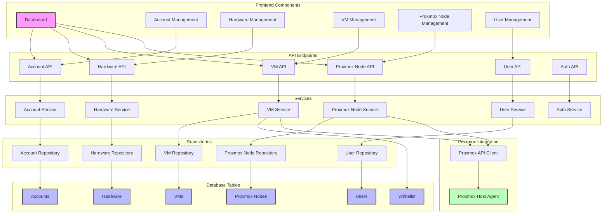

# Component Diagram

This diagram illustrates the detailed components of the AccountDB system and their interactions.

## Component Description

The AccountDB system consists of the following key components:

### Frontend Components
- **Dashboard**: Main interface showing overview of accounts, hardware, VMs, and Proxmox nodes
- **Account Management**: Interface for managing accounts
- **Hardware Management**: Interface for managing hardware resources
- **VM Management**: Interface for managing virtual machines
- **Proxmox Node Management**: Interface for managing Proxmox nodes
- **User Management**: Interface for managing users and permissions

### API Endpoints
- **Account API**: Endpoints for account operations
- **Hardware API**: Endpoints for hardware operations
- **VM API**: Endpoints for VM operations
- **Proxmox Node API**: Endpoints for Proxmox node operations
- **User API**: Endpoints for user operations
- **Auth API**: Endpoints for authentication and authorization

### Services
- **Account Service**: Business logic for account operations
- **Hardware Service**: Business logic for hardware operations
- **VM Service**: Business logic for VM operations
- **Proxmox Node Service**: Business logic for Proxmox node operations
- **User Service**: Business logic for user operations
- **Auth Service**: Business logic for authentication and authorization

### Repositories
- **Account Repository**: Data access for accounts
- **Hardware Repository**: Data access for hardware
- **VM Repository**: Data access for VMs
- **Proxmox Node Repository**: Data access for Proxmox nodes
- **User Repository**: Data access for users

### Database Tables
- **Accounts**: Stores account information
- **Hardware**: Stores hardware information
- **VMs**: Stores VM information
- **Proxmox Nodes**: Stores Proxmox node information
- **Users**: Stores user information
- **Whitelist**: Stores whitelist information for VM access

### Proxmox Integration
- **Proxmox API Client**: Client for interacting with Proxmox API
- **Proxmox Host Agent**: Agent running on Proxmox nodes for direct interaction
