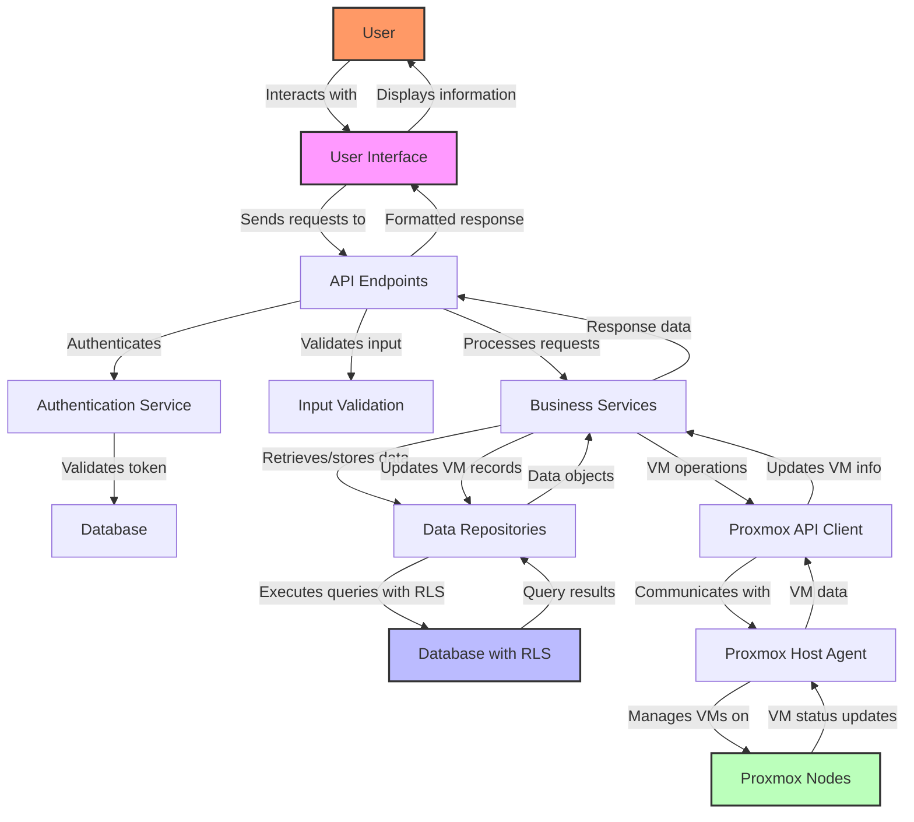

# Data Flow Diagram

This diagram illustrates the flow of data through the AccountDB system.

## Data Flow Description

The data flow in the AccountDB system follows these main paths:

### User Interaction Flow
1. User interacts with the User Interface
2. UI sends HTTP requests to API endpoints
3. API authenticates the request through the Authentication Service
4. Authentication Service validates the token against the database
5. API validates input data
6. API processes the request through Business Services
7. Services return response data to API
8. API formats and sends response to UI
9. UI displays information to the User

### Data Access Flow
1. Business Services request data from Data Repositories
2. Repositories execute queries against the database with Row-Level Security (RLS)
3. Database returns query results filtered by RLS policies
4. Repositories convert query results to data objects
5. Data objects are returned to Business Services

### Proxmox Integration Flow
1. Business Services send VM operation requests to Proxmox API Client
2. Proxmox API Client communicates with Proxmox Host Agent
3. Proxmox Host Agent manages VMs on Proxmox Nodes
4. Proxmox Nodes send VM status updates to Proxmox Host Agent
5. Proxmox Host Agent sends VM data to Proxmox API Client
6. Proxmox API Client updates VM information in Business Services
7. Business Services update VM records through Data Repositories

This data flow ensures proper separation of concerns, security through authentication and RLS, and integration with Proxmox for VM management.
