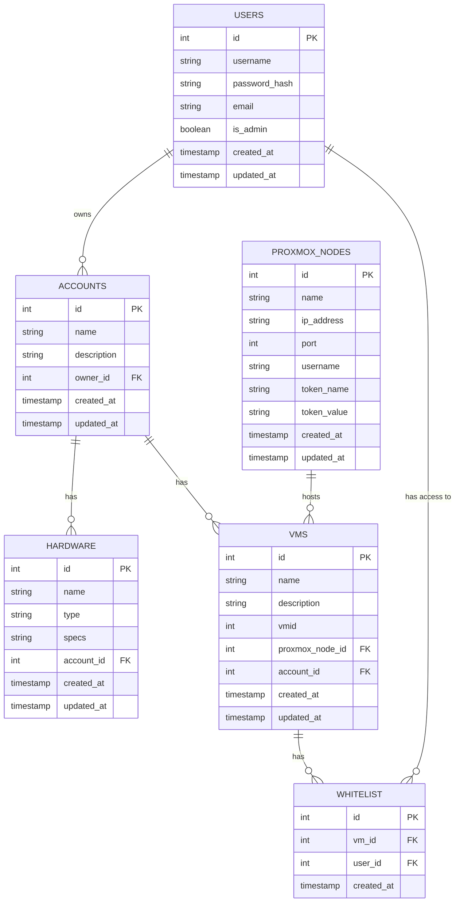

# Database Schema Diagram

This diagram illustrates the database schema of the AccountDB system, showing tables, relationships, and key fields.

## Schema Description

The AccountDB database schema consists of the following tables:

### USERS
- Stores user information including authentication details
- Primary key: `id`
- Contains fields for username, password hash, email, and admin status
- Has timestamps for creation and updates

### ACCOUNTS
- Stores account information
- Primary key: `id`
- Foreign key: `owner_id` references USERS.id
- Contains fields for name and description
- Has timestamps for creation and updates

### HARDWARE
- Stores hardware resource information
- Primary key: `id`
- Foreign key: `account_id` references ACCOUNTS.id
- Contains fields for name, type, and specifications
- Has timestamps for creation and updates

### VMS
- Stores virtual machine information
- Primary key: `id`
- Foreign keys: `proxmox_node_id` references PROXMOX_NODES.id, `account_id` references ACCOUNTS.id
- Contains fields for name, description, and Proxmox VM ID
- Has timestamps for creation and updates

### PROXMOX_NODES
- Stores Proxmox node information
- Primary key: `id`
- Contains fields for name, IP address, port, and authentication details
- Has timestamps for creation and updates

### WHITELIST
- Stores VM access permissions
- Primary key: `id`
- Foreign keys: `vm_id` references VMS.id, `user_id` references USERS.id
- Has timestamp for creation

## Row-Level Security (RLS)

The database implements Row-Level Security (RLS) policies to ensure data isolation:

1. Users can only see accounts they own
2. Users can only see hardware associated with accounts they own
3. Users can only see VMs associated with accounts they own or VMs they have whitelist access to
4. Admin users can see all data
