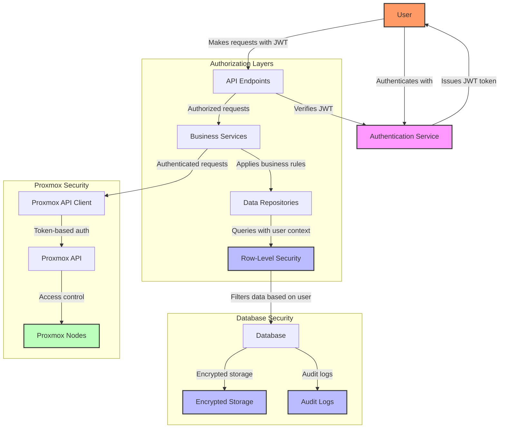

# Security Architecture Diagram

This diagram illustrates the security architecture of the AccountDB system.

## Security Architecture Description

The AccountDB system implements a multi-layered security architecture:

### Authentication
1. **User Authentication**: Users authenticate with the Authentication Service
2. **JWT Tokens**: Upon successful authentication, JWT tokens are issued to users
3. **Token Verification**: All API requests include JWT tokens that are verified before processing

### Authorization
1. **API Authorization**: API endpoints verify that users have appropriate permissions
2. **Business Logic Authorization**: Services apply business rules to ensure users can only perform allowed operations
3. **Data Access Authorization**: Repositories include user context in database queries

### Database Security
1. **Row-Level Security (RLS)**: PostgreSQL RLS policies filter data based on user context
2. **Data Encryption**: Sensitive data is encrypted in the database
3. **Audit Logging**: Database operations are logged for audit purposes

### Proxmox Integration Security
1. **Token-based Authentication**: Proxmox API Client uses token-based authentication
2. **Proxmox Access Control**: Proxmox nodes implement access control for VM operations
3. **Secure Communication**: All communication with Proxmox API uses HTTPS

### Additional Security Measures
1. **Input Validation**: All user input is validated to prevent injection attacks
2. **Error Handling**: Errors are handled securely without leaking sensitive information
3. **HTTPS**: All communication between client and server uses HTTPS
4. **Password Hashing**: User passwords are hashed using strong algorithms
5. **Rate Limiting**: API endpoints implement rate limiting to prevent abuse

This multi-layered security architecture ensures that data is protected at all levels of the system, from user authentication to database access and Proxmox integration.
