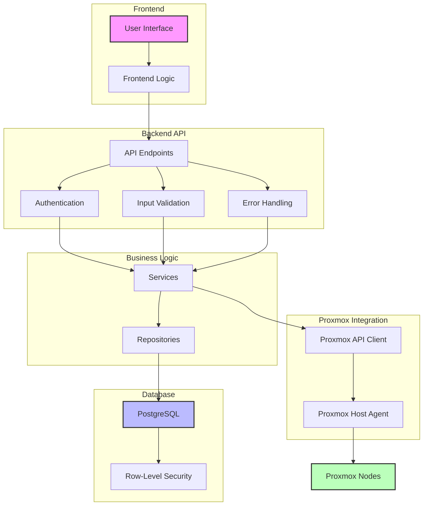

# System Architecture Diagram

This diagram illustrates the high-level architecture of the AccountDB system.

## Architecture Description

The AccountDB system follows a layered architecture with clear separation of concerns:

1. **Frontend Layer**: Provides the user interface and client-side logic for interacting with the backend API.
   
2. **Backend API Layer**: Handles HTTP requests, authentication, input validation, and error handling.
   
3. **Business Logic Layer**: Contains services that implement business rules and repositories that abstract database access.
   
4. **Database Layer**: PostgreSQL database with Row-Level Security (RLS) to ensure data isolation between users.
   
5. **Proxmox Integration Layer**: Connects to Proxmox nodes through a host agent and API client to manage VMs and containers.

This architecture promotes maintainability, scalability, and security by separating concerns and implementing proper access controls.
